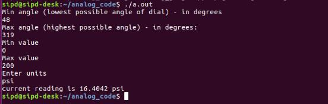

# DISCONTINUATION OF PROJECT #
This project will no longer be maintained by Intel.
Intel has ceased development and contributions including, but not limited to, maintenance, bug fixes, new releases, or updates, to this project.
Intel no longer accepts patches to this project.
# Analog Gauge Reader

| Programming Language | C++ |
| --- | --- |
| Skills (beg, intermediate, advanced) |  Intermediate |
| Time to complete project (in increments of 15 min) |   |
| Hardware needed (hardware used) | UP Squared* Grove IoT Development Kit |
| Target Operating System | Ubuntu* 16.04  |

## Introduction

This sample application takes an image frame of an analog gauge and reads the value using functions from OpenVINO™. It consists of two parts: calibration and measurement. During calibration, the application calibrates an image of a gauge that is provided by the user by prompting the user to enter the range of gauge values in degrees. It then uses these calibrated values in the measurement stage to convert the angle of the dial into a meaningful value.

## What You'll Learn

How to calibrate and measure an image using functions from OpenVINO™.

## Gather Your Materials

-   OpenVINO™
-   Host Computer with Intel® System Studio 2018 installed (OS : Ubuntu* 16.04 LTS)
-   UP Squared* Board with Ubuntu* 16.04 LTS
-   A monitor, keyboard, and mouse for the UP Squared* board

## Setup

1. Take a picture of a gauge. If you name it something other than 1.jpg make sure to change that in the main() function.

2. Run the application analog_gauge.cpp and enter the requested values, using the output file #.calibration.jpg to determine the values.
 

3. For the calibration image (#.calibration.jpg), enter in the Lowest possible angle of the dial, Highest possible angle of the dial, Minimum value, Maximum value, Units.

4. The application by default reads the value of the gauge of the image you used for calibration. For the provided image, it gives the result of 16.40 psi which is not bad.

## How it works

The main functions used from the library are HoughCircles (to detect the outline of the gauge and center point) and HoughLines (to detect the dial). Basic filtering is done as follows: For cirles (this happens in calibrate_gauge() ).

Only return circles from HoughCircles that are within reasonable range of the image height (this assumes the gauge takes up most of the view).
Apply a threshold using cv2.threshold. and cv2.THRESH_BINARY_INV with threshold of 175 and maxValue of 255 works fine.
Remove all lines outside a given radius.
Check if a line is within an acceptable range of the radius.
Use the first acceptable line as the dial.

## Optimization tips

1. Good lighting is key. Make sure there are no shadows if possible.
2. Gauges with very thin or small dials may not work well, thicker dials work better.
3. diff1_Lower_Bound, diff1_Upper_Bound, diff2_Lower_Bound, diff2_Upper_Bound determine the filtering of lines that don't represent the dial. You may need to adjust this if it's not returning any lines found.

There is a considerable amount of trigonometry involved to create the calibration image, mainly sine and cosine to plot the calibration image lines and arctangent to get the angle of the dial. This approach sets 0/360 to be the -y axis (if the image has a cartesian grid in the middle) and it goes clock-wise. There is a slight modification to make the 0/360 degrees be at the -y axis, by an addition (i+9) in the calculation of p_text[i][j]. Without this +9 the 0/360 point would be on the +x axis. So this implementation assumes the gauge is aligned in the image, but it can be adjusted by changing the value of 9 to something else.

**Important Notice**: This software is sample software. It is not designed or intended for use in any medical, life-saving or life-sustaining systems, transportation systems, nuclear systems, or for any other mission-critical application in which the failure of the system could lead to critical injury or death. The software may not be fully tested and may contain bugs or errors; it may not be intended or suitable for commercial release. No regulatory approvals for the software have been obtained, and therefore software may not be certified for use in certain countries or environments.
